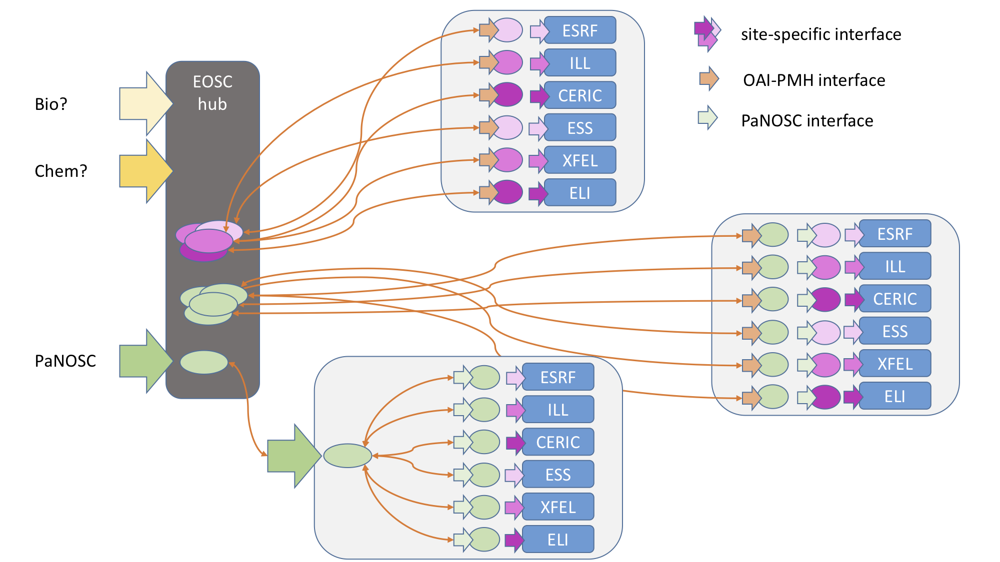

# 20190523 PaNOSC WP3 Kick-Off Meeting

## Website
https://indico.esss.lu.se/event/1233/

## Attendees

* Alessandro Olivo (CERIC)
* Emiliano Coghetto (CERIC) 
* Lajos Schrettner (ELI)
* Alejandro de Maria Antolinos (ESRF)
* Tobias Richter (ESS)
* Gareth Murphy (ESS)
* Fredrik Bolmsten (ESS)
* Stuart Caunt (ILL)
* Jamie Hall (ILL)
* Luis Maia (XFEL)

## Agenda

* Summary and status round table
* Task 3.1: Use cases for FAIR data API
* Task 3.1: FAIR data API development discussion
* Technology choices for API: OAI-PMH, OpenAire, b2find, ResourceSync
* Task 3.2 Provisioning Federated Search & EOSC Hub
* Task 3.4: Catalog Integration Discussion
* Connections with other work packages and ExPaNDs
* Task 3.5 Metadata ontologies for catalogs
* Future plans including post PaNOSC
* Wrap-up: Deliverables and Progress Tracking

## Summary and status round table

The initial presentation welcomed all partners to kickoff. Our core goal is to make PaNOSC data Findable, Accessible Interoperable and Reusable (FAIR). As can be seen from the data catalog survey, we have 6 different catalogues with little overlap in terms of technology. The Panosc KPIs include moving to metadata definitions and catalogues by 2023 and establishing data services and common data API, for which WP3 plays a vital role. Of the upcoming deliverables and milestones, the first is a survey of APIs and roadmap to EOSC.

ILL 

* ILL is sharing open data using OAI-PMH via DataCite

* The metadata format is Dublin Core

* For ILL, the NeXus (meta)data format varies for every one of 54 instruments

* DOIs are integrated into ILL’s data catalogue

CERIC 

* VUO is not a data catalogue 

* Elettra uses VUO

* Other CERIC partners have different or no solutions 

* Files are often HDF5, but not NeXus

ESRF

* Icat + NeXus with ESRF schema

* Automatic capture of metadata

* Tango

* DOI minted for every proposal

XFEL 

* XFEL uses myMDC as a data catalogue

* has DOI integration

* HDF5 files, not NeXus

ESS

* SciCat 

* One beamline, V20 in HZB

* Automatic capture of metadata in progress

* NeXus, very similar between instruments

ELI 

* data catalogue TBD

* Data policy underway

* Data is different formats

The 6 PanOSC partners are at varying stages of catalogue use, ranging from beginning (ELI), to partial integration (CERIC,ESS) to full integration (ESRF, ILL). We all lack open data with full metadata.

**Stuart Caunt - Use Cases:**

Stuart presented the use cases collected so far on Github, with the intention to decide what should be part of the core WP scope and what may be optional. As the main objective we will provide data to be harvested/pulled by EOSC/b2find/OpenAire and develop an API, focusing on open data users. Authentication will be required for data analysis/WP4 case, where the intention is to access embargoed data. The API will allow an optional integration of a suitable authentication solution from WP6 for searches. Access to the data, for download, processing or other purposes, will be possible via a link or identifier returned from the search (public or not), however there may be further access restrictions when following the link that are outside of the WP3 scope. Gathering KPIs for reporting will be done outside of the core FAIR data API.

**Task 3.1: FAIR data API development discussion**

The FAIR data API presentation showed a roadmap to start providing open data to EOSC Hub with OAI-PMH by providing an OAI-PMH endpoint and schema mapper to map individual database schema to shared PaNOSC schema. We can provide our metadata to EOSC data discovery services such as b2find, OpenAire to be harvested. Initially this can be limited to Dublin Core (which lacks the desired domain specific extensions we aim for). Each partner will mint DOI’s via Datacite, this in turn will provide a OAI-PMH endpoint that can be used for harvesting. Hitting this mark is a simple but important step that not all partners have taken. The next step is to address domain specific needs, either in the query endpoints or on the payload.

**Task 3.2 Provisioning Federated Search & EOSC Hub**

We will provide open data to EOSC hub actors e.g. OpenAire, b2find. They can harvest our data over e.g. OAI-PMH or ResourceSync. For the fair data api, we also require a search demonstrator for EOSC hub. WP4 will need to query authenticated data. 

The below diagram shows routes for the fair data API. The first route shows a hypothetical scenario with separate site-specific interface at each site, sharing data with EOSC. The second route shows common panosc interfaces at each site, with site specific connectors to the various catalogues. Routes 1 and 2 allow data to be shared via OAI-PMH as in task 3.1. The third route is using a common panosc search hub, the demonstrator. When under trusted control, this can serve authenticated access to embargoed data of PaNOSC partners facilities. This can address the needs of WP4.

Each partner will create a wrapper for their site-specific metadata catalog API that will map to a OAI-PMH interface definition created in WP3.1. The OAI-PMH interfaces can be called directly by data harvesting actors or be used via the central hub. The central hub will have the same interface as the facilities and will act as one endpoint for querying all.

Figure 1: PaNOSC routes for data sharing via OAI-PMH and federated search of embargoed data.

**Task 3.4: Catalog Integration Discussion**

Distributed facilities, such as CERIC-ERIC and ELI has to cope with the data catalogue integration task internally on facility level as well, communicating, harmonizing, and introducing a data catalogue at each member of the infrastructure.

ELI does not have a data catalogue, so the goal is to introduce a common one compatible or identical with the PaNOSC catalogue, which will be available by then.

Some CERIC-ERIC members have their own solutions, so an internal survey is necessary to clarify status, and plan further actions towards the PaNOSC catalogue. Treating CERIC-ERIC members with existing catalogues as if they were individual institutions is an option from a technical point of view.

**Connections with other work packages and ExPaNDs**

We have established contacts with other work packages.

* WP2

Andy - Alex

 

* WP4

Jamie (both sides)
XFEL will host WP4 meeting 20190625+27 - we will have several WP3 attendees.

* WP6

Jamie - Jean-Francois

* Contacts with ExPaNDS 

Tobias/Fredrik - Gert/Alun/Stephan

----

**Friday**

**Tobias Richter - Task 3.5 Metadata ontologies for catalogs**

* NeXus tree is flexible structure

* [www.nexusformat.org](www.nexusformat.org)

* Committee has non facility members

* Don’t use legacy NeXus API

* NXcite, can give attribution to software that generated nexus files

* Developers e.g. us

* Provenance and relationships

**AI - all facilities without current representation - Get people on NeXus committee**

**AI - all - Collect example files with different NeXus (or other) flavours**

Will go around facilities in telcos in the coming weeks and discuss/share in the following order:

* ILL

* ESS

* ESRF

* CERIC

* XFEL

* ELI

**Future plans including post PaNOSC**

**Wrap-up: Deliverables and Progress Tracking**

* CERIC includes other groups as well as Elettra with different needs

* The ESRF shared schema was discussed - nothing can be written to file if not in schema. This involves defining e.g. instrument names before use.

* See [https://gitlab.esrf.fr/icat/hdf5-master-config/blob/master/hdf5_cfg.xml](https://gitlab.esrf.fr/icat/hdf5-master-config/blob/master/hdf5_cfg.xml)

On Oct 21-22 PaNOSC yearly meeting will be held in Trieste

Oct 23-24 we have potential for crossover meetings with e.g. WP4 in Elettra

We find that Github is not best tool for collaboration, particularly for drawing sketches and class diagrams. ILL have volunteered to host a Confluence instance.

**AI **Jamie - setup confluence

**AI **Gareth - schedule fair data API telecon

**AI** Stuart & Jamie - Sept 17-18 API meeting in ILL

**AI **List risks to project and possible mitigations - catalogue not implemented at ELI, authentication not working

Deliverables and Milestones

Milestones @ 12 Months

Catalogue Survey and API 

Deliverable at 18 months - API definition

**AI - **Gareth - Kanban board in Github wp3 project

[https://github.com/panosc-eu/wp3/projects/1](https://github.com/panosc-eu/wp3/projects/1)

**AI - all - Each partner prepares one slide on fair data api for next telecon**

What queries can we put?

**AI - all - Each partner presents their own API**

