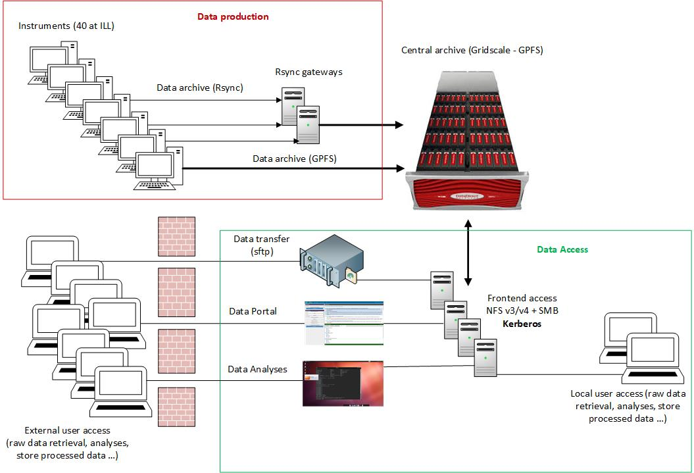

#  WP6 fortnightly telco #8

11th June 2019 - 11H00 CET

Attendees : Marco, Carlos (CERIC), Giuseppe (EGI), Sarah - Minutes - & Jean-François (ILL),

Link for the telco: https://ill.vidyocloud.com/join/NWc9VqX5Sz

## Agenda:

1. General organisation
2. In order to make concrete progress and get the support from our 
   non-RI colleagues, I would like to propose that each RI describes its 
   internal infrastructure and workflow related to data management (from 
   the acquisition to the archive and access by users)
3. Clarify on the RI side who is ready to engage in the technical tasks.
4. I would like to state on the ongoing recruitments and related 
   difficulties if any.
## Discussions:

We have discuss the Data service architecture based on the ILL diagram.

